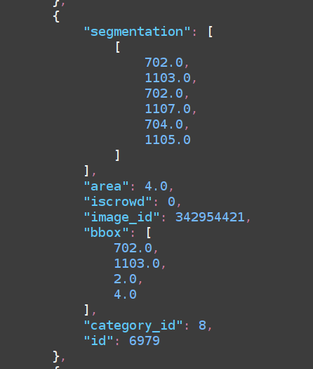
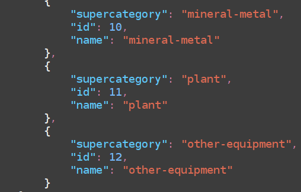

# A Computer Vision Dataset for Alchemical Illustrations
This repo contains my work on annotating images from https://alchemie.hab.de/bilder for computer vision (object detection) as part of my 2024-08 NFDI4Memory Fair Data Fellowship, including scraping the images.

Below you will find explanations of the processes involved (scraping data, processing links, getting metadata, annotation in Supervisely) and the files in the repo. Use the section headings to find the info you need. This readme is structured as follows (following the steps from first scraping to finally arriving at this dataset/repo):
1. The data and what to use it for
2. The scraping script
3. Book Metadata Scraper
4. Dataset Documentation: Alchemical Laboratory Object Detection Annotations (YOLO8 & MS COCO Formats)
5. Explanation of the Repository Contents (which file is what)
6. Links & Additional Resources

## The data and what to use it for 
HAB's alchemy portal (https://alchemie.hab.de) offers IconClass categories extended specifically to tag alchemy images. 
A number of book pages containing such illustrations (digitized in the project) were tagged using those categories.
Amongst them are alchemical instruments, in which I am particularly interested.

To make the data usable for computer vision (specifically object detection), the locations of the objects on the images need to be specified in a usable image annotation format (such as MS COCO) so they can be used to train machine learning algorithms.

To make that possible, the following script allows me (and you) to select a number of those categories, then the links to all images tagged with this category will be scraped from the webpage and later downloaded.

---

## The scraping script
The script (`scrape-hab-alchemyImgs.py`) takes the categories from the categories csv file (`hab-alchemical-categories-links.csv`) that needs to be present in the same folder as your script for this to work. 

This file only contains the categories I was interested in (alchemical laboratory instruments, but there are more categorgies!), so if you want to download anything else, you need to extend that csv file (`hab-alchemical-categories-links.csv`). You address them in the script via their `categoryShorttitle` so the name you put in this field needs to be exactly the same as what you put in `categories_to_process` in `scrape-hab-alchemyImgs.py` (around 150 lines in is where the 'main part' begins, look there). 

Run the phython script to scrape your chosen image categories:
```
python3 scrape-hab-alchemyImgs.py
```
It will first save all links it scraped in a csv file (`all_image_links.csv`), 
then deduplicate them (so you only download each image once, as that meets my use case, adapt as needed) 
and save the result of that deduplication process in a csv file (`deduped_image_links.csv`) as well.
Finally, it will use the deduplicated csv file to download the images using wget. 

### Usage recommendations 
I recommend trying out the script using a category that only contains a few images (such as 'cupel'), then delete all files that were created by the script (not the categories csv but the log, the other csvs and the folders with the downloaded images). This isn't strictly necessary but may prevent confusion and duplicated downloads.

My goal was to only download the least amount of images necessary. That's why it makes sense that after you have done the test run, you select all the categories you want and download them in one go (that way deduplication will be the most effective, saving you from unnecessarily downloading some images multiple times). 
The deduplicated csv file (`deduped_image_links.csv`) still documents all the categories it was tagged with for your future reference. 

Success or any problems are logged in the log (`image_download.log`) and the terminal. 

---

## Book Metadata Scraper

I later added two scripts for scraping and processing metadata for the books included in the dataset. It is important to have an overview over which books and images are included in the dataset as not to mix up the training and evaluation data. 

The Python script `extract-hab-metadata-from-image-links.py` scrapes bibliographic metadata from HAB's digital library based on image links provided in a CSV file (). It constructs viewer and METS XML links from the image links, fetches the metadata stored in the XML file, and extracts the author, title, publishing place, publisher, and publication year, where available. The results are saved into a new CSV file.
Run as follows: 
```
python3 extract-hab-metadata-from-image-links.py
```
I set the input to be the file `deduped_image_links.csv` (outputted by the script above) and the output will be named `output_hab_imgs_metadata.csv`. However, you can adapt this to your own needs in the "Run the script" section of the code (towards the very end, denoted by a comment). 

The script will achieve the following things: 
- **Transforms image links**: Converts image links into viewer links and METS XML links. These make it easier for you to click into the book, as the links we saved before only lead to the downloadable image from where there is no way to directly look though the book (in case you need context or need to find out what book the image is actually from). 
- **Fetches XML metadata**: Retrieves bibliographic metadata stored in the METS XML files for each book. However, the HAB METS service seems to be somewhat faulty at this point, so most entries offer no bibliographic metadata there or, if they do, it is incomplete. I'm told this is being investigated. Until then, you should be able to get all the information from [HAB's OPAC library system/online catalog](https://opac.lbs-braunschweig.gbv.de/DB=2/LNG=DU/) using the signatures available to you in the data.

The script will generate a new CSV file containing the following fields:
- **original_image_link:** The original image link from the input.
- **viewer_link:** The transformed viewer link.
- **mets_link:** The link to the METS XML file.
- **bibliographical_description:** The full bibliographic citation string.
- **author:** The author, if available.
- **title:** The title of the work.
- **publishing_place:** The place of publication, if available.
- **publisher:** The publisher, if available.
- **publication_year:** The publication year, if available.

The `mets.xml` file only contains an unstructured bibliographical description, however, if present, the fields seem to be separated in a standardized manner. However, since most of my books did not have any or only incomplete bibliographical references there, the extraction of the relevant entities might be faulty. I did not fix this because it mostly wasn't relevant anyway but you might if you re-use this script for your own data. 

This is an example of a bibliographical description (almost complete but missing the author/editor):
```
<dct:bibliographicCitation>Dyas Chymica Tripartita, Das ist: Sechs Herrliche Teutsche Philosophische Tractätlein ... - Franckfurt am Mayn : Jennis, 1625</dct:bibliographicCitation>
```

Examples like this might produce errors: 
```
<dct:bibliographicCitation>Libavius, Andreas: Alchymia Andreæ Libavii, Recognita, Emendata, Et aucta</dct:bibliographicCitation>
```
The output in this case should look like:
```
original_image_link,viewer_link,mets_link,bibliographical_description,author,title,publishing_place,publisher,publication_year
https://diglib.hab.de/drucke/nd-123/00123.jpg,https://diglib.hab.de/drucke/nd-123/start.htm?image=00123,https://diglib.hab.de/drucke/nd-123/mets.xml,"Libavius, Andreas: Alchymia Andreæ Libavii, Recognita, Emendata, Et aucta","Libavius, Andreas","Alchymia Andreæ Libavii, Recognita, Emendata, Et aucta",None,None,None
```

Required libraries can be installed like so:
```
pip install requests beautifulsoup4 lxml
```
---
## Sorting the book metadata output by pages included
This script will just use the output of the last (no more scraping) and reduce it so that there's only one line for each book/signature included but this line has a list of all the pages from this book that were included in the dataset. 

Run as follows: 
```
python3 get-hab-img-metadata-for-dataset.py
```
The naming of the last two python scripts is a little bit confusing, sorry about that. They need to be run in the order they are listed here.
I set the input to be the file `output_hab_imgs_metadata.csv` (outputted by the script above) and the output will be named `hab-dataset-img-metadata.csv`. However, you can adapt this to your own needs in the "Run the script" section of the code (towards the very end, denoted by a comment). 

The output can be imported in a sheet software of your choice, however, please note that LibreOffice for some reason omits page numbers from entries where there is only one page number. Initially, I suspected this was due to different CSV quoting options (one single page is treated like an integer and the field is not in double quotes in the CSV output, whereas the lines with multiple comma-separated page numbers are in quotes) but this didn't make a difference. The error does not appear when importing to GoogleSheets, for instance, so I didn't fix it - but please be aware of this caveat. 
Once it's imported, you can fill in the gaps in the metadata using the library system. 

---
Here is a draft for the documentation of the dataset based on the information you provided:

---

## Dataset Documentation: Alchemical Laboratory Object Detection Annotations (YOLO8 & MS COCO Formats)

This dataset contains pixel-level annotations for 12 categories of alchemical objects derived from images of digitized manuscripts held at the Herzog August Bibliothek (HAB) Wolfenbüttel. The annotations are provided in two formats: **YOLOv8** and **MS COCO**. The dataset is designed for object detection tasks relating to apparatus depicted in early modern manuals of chymistry, metallurgy, mining and distillation. It includes categories such as ampullae, cucurbitae, furnaces, and more (see details below). 

### YOLOv8 Format

In the `yolo8-labels/train/` directory, each image has a corresponding `.txt` file with its annotations. These `.txt` files are named according to the pattern:  
`[Supervisely Prefix]_[HAB Signature]_[Page Number].txt`.  
For example: `971588_nd-2f-1-1b_00973.txt`. The `971588_` is an irrelevant prefix, automatically generated by the Supervisely platform, while the remainder of the filename (`nd-2f-1-1b_00973.txt`) reflects the manuscript's signature (`nd-2f-1-1b`) and the corresponding page number (`00973`).

Each image's YOLOv8 annotations are stored in `.txt` files within the `train/` directory. To use these annotations with a YOLOv8 model, ensure that your image dataset is organised accordingly. The annotations contain normalised coordinates that the model can use to detect objects during training or inference.

The annotations within each `.txt` file follow the YOLOv8 format, where each line represents an object detected in the image with the following structure:
```
[class_id] [x_center] [y_center] [width] [height] [x1] [y1] ... [xN] [yN]
```
The coordinates are normalised relative to the image size, making them model-ready for YOLOv8. 


### MS COCO Format

MS COCO annotations provide information for object detection and segmentation tasks. The MS COCO annotations are stored in a single JSON file, `hab-achemieobjekte-msCoco.json`. This format is more human-readable and provides detailed information about images, objects, and segmentation masks. The structure includes the following main components:
- **info**: General dataset information, including description, contributor, and version.
- **licenses**: Placeholder information (not relevant for this dataset).
- **images**: Metadata for each image, such as file name, dimensions, and an ID.
- **annotations**: Detailed object annotations for each image, including segmentation polygons, bounding boxes, category IDs, and object IDs.
- **categories**: Lists the 12 object categories with corresponding IDs and names.

To use these with a COCO-compatible model, load the `hab-achemieobjekte-msCoco.json` file and ensure your images are structured in accordance with COCO conventions.

### Image Downloading

The actual image files are not included in this repository. However, you can download the images using the provided scraping script, which fetches them from the Herzog August Bibliothek’s digital library. The `csv` files included in the dataset contain download links and metadata that help locate the corresponding images and books within the library's online collection.

To reference an image based on its YOLO annotation file name, simply use the HAB signature and page number found in the name of the `.txt` file. These can be matched with entries in the accompanying `csv` files to find relevant links and metadata.

## Categories

The annotations cover 12 categories of alchemical objects:

1. Ampullae
2. Animal
3. Cucurbitae
4. Cucurbitae-ambix
5. Ollae
6. Cucurbitae-retorte
7. Cucurbitae-rosenhut
8. Furnace
9. Human
10. Mineral-metal
11. Plant
12. Other-equipment

---

# Explanation of the Repository Contents

## CSV Files (Metadata & Image Links)

- `2024-09-25_hab-dataset-img-metadata.csv` contains metadata about the books in the dataset, as scraped from the [Herzog August Bibliothek's digital library](diglib.hab.de) using `extract-hab-metadata-from-image-links.py` and `get-hab-img-metadata-for-dataset.py`. See the section 'Book Metadata Scraper' for detailed explanation. 
- `all_image_links.csv` contains links to all images used in the dataset from the first round of scraping (still needs deduplication): 
- `deduped_image_links.csv` is deduplicated version of the `all_image_links.csv`, ensuring that each image is only listed once (it may have been in the initial list more than once because that went by annotations and each image could have more than class assigned in the HAB IconClass annotation). 
- `hab-alchemical-categories-links.csv` contains links to the relevant categories of different types of alchemical objects in the HAB IconClass. You can adapt the scraping script to include as many of those as you wish. 
- `hab-dataset-img-metadata.csv` is the final metadata file for the dataset, containing bibliographical info for each book in the dataset (as far as the METS files provided at the time of downloading).
- `output_hab_imgs_metadata.csv` contains the book metadata output by image/page included in the dataset. 

## Python Scripts (Metadata Extraction & Image Scraping)

- `extract-hab-metadata-from-image-links.py` extracts metadata from the image links provided in the `csv` files for enriching the dataset with bibliographic information.
- `get-hab-img-metadata-for-dataset.py` reduces the output from the script above so that it only covers each book once (not each page) relating to the images in the dataset.
- `scrape-hab-alchemyImgs.py` is the aforementioned scraping script that can be used to download images from the Herzog August Bibliothek’s online collection based on links provided in the `csv` files. For a detailed explanation, see the section 'The scraping script'. It will first save all links it scraped in a csv file (`all_image_links.csv`), deduplicate them (so you only download each image once) 
and save the result of that deduplication process in a CSV file (`deduped_image_links.csv`) which it will use to actually download the images using `wget`.
- (related) `image_download.log` tracks the progress and status of the image download process generated by the scraping script above.

## The Actual Dataset

### The files
- `hab-achemieobjekte-msCoco.json` contains the object annotations in MS COCO format, which are more human-readable than the YOLO format.
- `yolo8-labels-train.zip` is the train folder of YOLOv8 formatted annotations I explained above (but it had to be zipped for upload here). 
- `yolo8-labels-data_config.yaml` is the configuration file for the YOLOv8 annotations. The configuration file lists the annotation classes, colour information, and paths to the `train` and `val` datasets. Although paths to these datasets are specified, you need to download the images yourself, as they are not included in this repository (and already archived in HAB's digital library). Look up how to properly structure your data so it's ready for actually using the algorithms. 

### A Few Image Examples for MS COCO and YOLOv8 annotation formats from this dataset
A visual example demonstrating a single annotation in MS COCO format.


An illustration showcasing the categories used in the MS COCO dataset format.



---

## Links & Additional Resources

- **YOLOv8 Label Format**:  
  For more information on the YOLOv8 label format:  
  [YOLOv8 Label Format](https://yolov8.org/yolov8-label-format/)

- **MS COCO**:  
  You can learn more about the MS COCO dataset and format here:  
  [COCO Dataset Official Site](https://cocodataset.org/)  
  [Papers with Code - COCO Dataset](https://paperswithcode.com/dataset/coco)
  
- **Related LaTeX Ninja Blogpost on Annotating with [Supervisely](https://supervisely.com)**:  
  [How to Create Your Own Fine-Tuning or Training Dataset for Computer Vision Using Supervisely](https://latex-ninja.com/2024/09/06/how-to-create-your-own-fine-tuning-or-training-dataset-for-computer-vision-using-supervisely/)

- **Examples of the Annotation Process**:  
  An example of what annotating the images looked like in [Supervisely](https://supervisely.com):  
    
  This image illustrates what the data looks like and the annotations (what was annotated and how):  
  

---


