# Corpus Visualizations: Alchemical Laboratory Objects Dataset

Documentation for the 25 figures generated by `visualize_corpus.py`, analyzing the metadata of the 98 source books in the alchemical laboratory objects dataset.

**Data source:** `master_metadata.csv` (98 rows, 51 columns). See `README.md` for the full column reference and provenance pipeline.

**Technical note on author names:** Several figures use a derived field `author_display`, which picks the best available author name for each entry using this priority: `author_likely_identical_shared` (canonical group name from ChatGPT) > `author_normalized_inferred` (ChatGPT-improved form) > `author_normalized` (mechanically normalized). This ensures that variant spellings for the same person (e.g., "Athanasius Kircherus" and "Athanasius Kircher") are counted together.

**Rendering:** All figures are saved at 150 DPI as PNG files in the `figures/` directory. The script uses `bbox_inches="tight"` on all saves to prevent label clipping.

---

## Table of Contents

1. [Books per decade](#1-books-per-decade)
2. [Top 15 publication places](#2-top-15-publication-places)
3. [Language distribution](#3-language-distribution)
4. [Authors with 2+ books](#4-authors-with-2-books)
5. [Pages per book (HAB)](#5-pages-per-book-hab)
6. [Edition groups over time](#6-edition-groups-over-time)
7. [Timeline scatter (HAB)](#7-timeline-scatter-hab)
8. [Collection overview](#8-collection-overview)
9. [Place × decade heatmap](#9-place--decade-heatmap)
10. [Author × place heatmap](#10-author--place-heatmap)
11. [Publisher × decade heatmap](#11-publisher--decade-heatmap)
12. [Language by decade](#12-language-by-decade)
13. [Edition geographic spread](#13-edition-geographic-spread)
14. [Publisher × place heatmap](#14-publisher--place-heatmap)
15. [Author publication timelines](#15-author-publication-timelines)
16. [Place × language](#16-place--language)
17. [Edition language shifts](#17-edition-language-shifts)
18. [Edition detail: place, publisher, language](#18-edition-detail-place-publisher-language)
19. [Translation flows](#19-translation-flows)
20. [Prolific author works detail](#20-prolific-author-works-detail)
21. [Edition longevity](#21-edition-longevity)
22. [Author–publisher relationships](#22-authourpublisher-relationships)
23. [Author geographic reach](#23-author-geographic-reach)
24. [City activity timelines](#24-city-activity-timelines)
25. [Language proportions over time](#25-language-proportions-over-time)

---

## 1. Books per decade

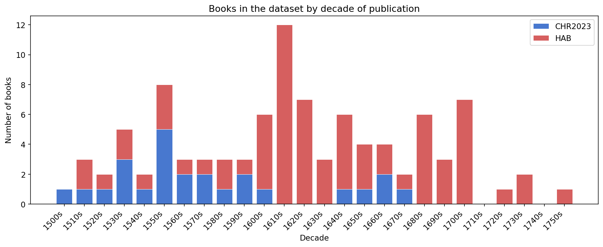

### Technical details

- **Chart type:** Stacked bar chart.
- **X axis:** Decade (derived from `year_normalized`, computed as `year // 10 * 10`). Labels show "1500s", "1510s", etc.
- **Y axis:** Number of books.
- **Stacking:** Each bar is split into two segments by `source_collection`: CHR2023 (blue) and HAB (red). CHR2023 is drawn first (bottom), HAB stacked on top.
- **Missing data:** 1 of 98 entries lacks a year and is excluded.
- **Assumptions:** The decade is computed from `year_normalized`, which is the best available publication year (manual > scraped > original). For approximate dates, the single best-guess year is used.

### What it shows

This figure shows when the books in the dataset were published, decade by decade, and which of the two source collections (CHR2023 or HAB) they come from. The dataset covers roughly 250 years of publishing, from the 1500s to the 1750s. The peak is in the 1610s, and there is a noticeable dip in the 1660s–1670s. The CHR2023 corpus contributes books across most decades but is smaller overall; the HAB collection provides the bulk of the material, especially in the 17th century.

---

## 2. Top 15 publication places

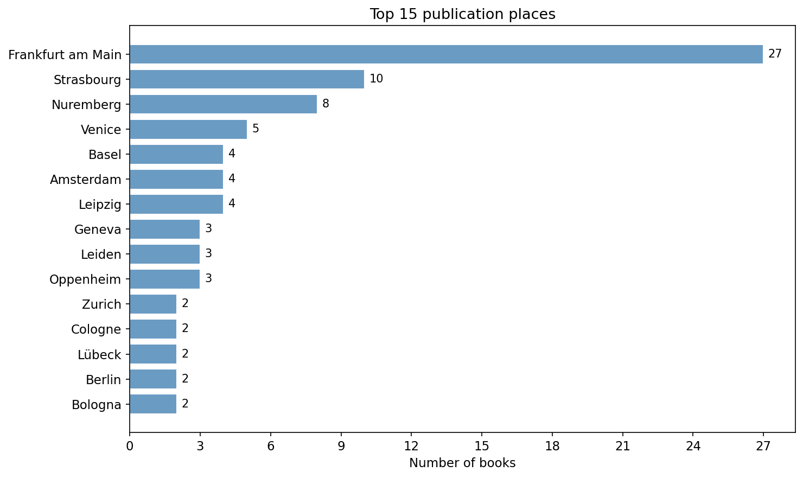

### Technical details

- **Chart type:** Horizontal bar chart.
- **Data field:** `place_normalized` — publication places mapped to modern English city names via a ~90-entry lookup table (e.g., "Francofurti" → "Frankfurt am Main", "Argentorati" → "Strasbourg").
- **Filtering:** Entries with no place information are excluded.
- **Metric:** Simple count of books per place. Bars are sorted by frequency, descending.
- **Labels:** Exact count shown to the right of each bar.

### What it shows

Frankfurt am Main dominates the corpus with 27 books — more than the next two cities (Strasbourg: 10, Nuremberg: 8) combined. This reflects Frankfurt's historical role as the center of the German book trade and the location of major book fairs. The list includes major early modern printing centers across the German-speaking world (Frankfurt, Strasbourg, Nuremberg, Basel, Leipzig, Cologne), the Low Countries (Amsterdam, Leiden), Italy (Venice, Bologna), Switzerland (Zurich, Geneva), and France (Paris, Lyon). The single London entry represents an English translation of Brunschwig's distillation manual.

---

## 3. Language distribution

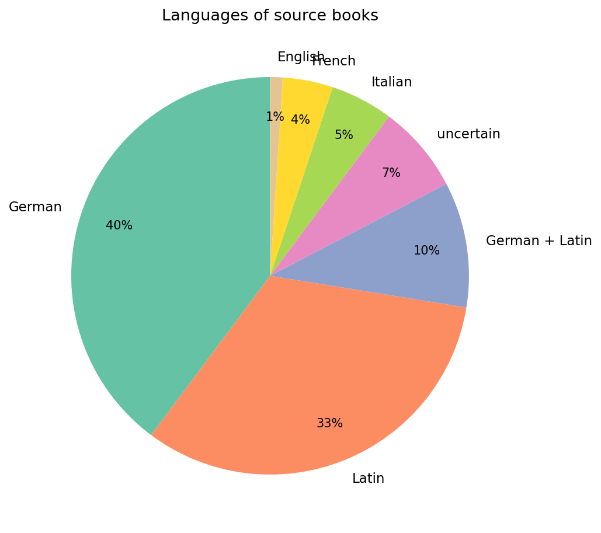

### Technical details

- **Chart type:** Pie chart.
- **Data field:** `language_normalized` — full language name. For HAB entries (which lacked language metadata), this was inferred by ChatGPT from the title and content of each book. For CHR2023 entries, it was mapped from original language codes (DE, EN, LAT, IT).
- **Filtering:** Entries with empty language are excluded (none in current data — all 98 have a language).
- **Categories:** German, Latin, German + Latin (bilingual works), Italian, French, English, uncertain.
- **Assumptions:** The "uncertain" category includes entries where the language could not be confidently determined (e.g., a Latin title page but German body text). "German + Latin" denotes genuinely bilingual publications, not books that merely have a Latin title.

### What it shows

German and Latin together account for the vast majority of the corpus. German is the most common single language, reflecting the heavy representation of practical handbooks (distillation manuals, assay books). Latin dominates among scholarly and encyclopedic works. The "German + Latin" category captures bilingual editions common in the period, where Latin was used for learned apparatus alongside German practical text. Italian works are almost all editions of Biringuccio's *Pirotechnia*. The single English entry is Brunschwig's *Liber de arte distillandi*, translated and published in London in 1527.

---

## 4. Authors with 2+ books

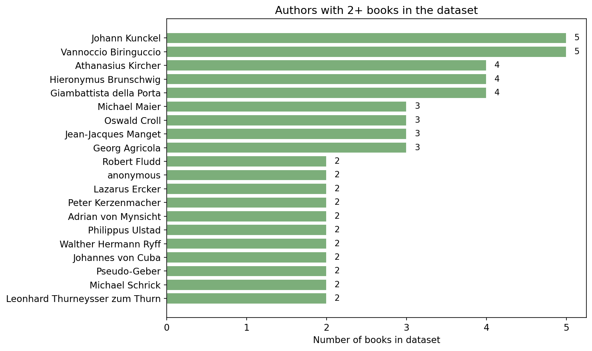

### Technical details

- **Chart type:** Horizontal bar chart.
- **Data field:** `author_display` (see note at top). This groups variant spellings: e.g., both "Athanasius Kircherus" and "Athanasius Kircher" count toward the same author.
- **Filtering:** Only authors with 2 or more books in the dataset. Authors listed as empty string are excluded. "anonymous" is included as a category.
- **Metric:** Count of books per author.
- **Assumptions:** The `author_likely_identical_shared` field was assigned by ChatGPT and manually reviewed. Pseudepigraphic attributions are preserved (e.g., "Pseudo-Geber" counts as a single author, distinct from the historical Jabir ibn Hayyan).

### What it shows

Johann Kunckel and Vannoccio Biringuccio lead with 5 books each — in both cases because the dataset includes multiple editions of their major works. Athanasius Kircher, Hieronymus Brunschwig, and Giambattista della Porta follow with 4 each. The chart reveals the "long tail": 22 authors appear at least twice, but most have exactly 2 entries (often two editions or a translation). The presence of "anonymous" (2 entries) reflects the tradition of anonymous technical handbooks, particularly the *Probierbüchlein* (assay manual) tradition.

---

## 5. Pages per book (HAB)

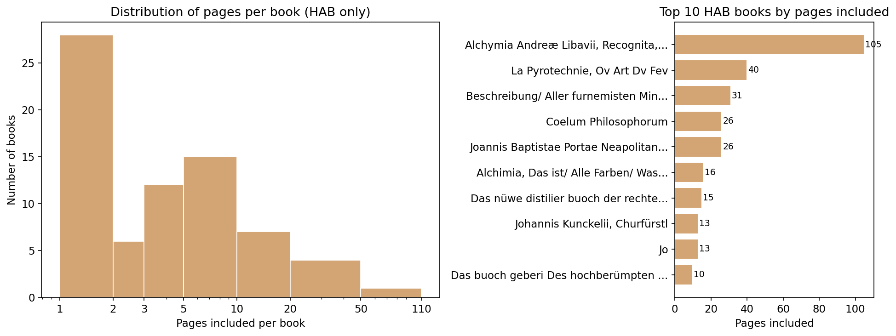

### Technical details

- **Chart type:** Two-panel figure. Left: histogram with logarithmic x-axis. Right: horizontal bar chart (top 10).
- **Data field:** `pages_included_count` — the number of digitized pages from each book included in the computer vision dataset. This is only available for HAB entries (73 books); CHR2023 entries lack this field.
- **Filtering:** HAB entries only, with valid page count.
- **Left panel bins:** [1, 2, 3, 5, 10, 20, 50, 110] — log-scale bins to show the skewed distribution.
- **Right panel:** Top 10 HAB books by number of pages included, with truncated short titles.

### What it shows

Most HAB books contribute only a few pages to the CV dataset (median around 2–3 pages), but a few books contribute disproportionately. Libavius's *Alchymia* (1606) is the largest single source with 104 pages — a massive illustrated encyclopedia of alchemy. The right panel shows that a handful of extensively illustrated books provide the bulk of the image data. This is important context for anyone using the CV dataset: the training images are not evenly distributed across source books.

---

## 6. Edition groups over time

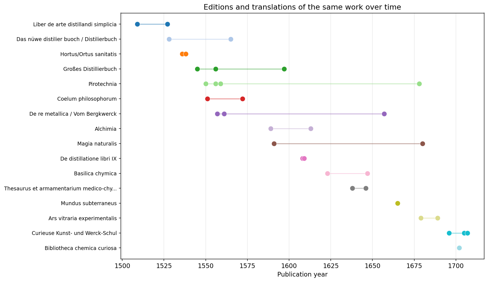

### Technical details

- **Chart type:** Scatter plot with connecting horizontal lines.
- **Data fields:** `short_title_likely_identical_shared` (canonical work title for grouping editions), `year_normalized`.
- **Filtering:** Only works with 2+ entries in the dataset. 17 such groups were identified, covering 45 of 98 entries.
- **Y axis:** Each row represents one work group, sorted by earliest publication year.
- **X axis:** Publication year. Dots mark individual editions; lines connect the earliest and latest edition.
- **Colors:** Each work has a distinct color (tab20 colormap).
- **Assumptions:** The "likely identical" groupings were established by ChatGPT and manually reviewed. They link different editions, translations, and reprints of the same underlying work.

### What it shows

This figure shows which works appear multiple times in the dataset as different editions or translations, and how they spread over time. Some works had remarkably long publishing lives: Biringuccio's *Pirotechnia* spans 128 years (1550–1678), and Agricola's *De re metallica* spans 100 years (1557–1657). Others cluster tightly (Mundus subterraneus: 4 entries all from 1665, representing different volumes or issues of the same Amsterdam edition). The connecting lines make it easy to see which works persisted across generations.

---

## 7. Timeline scatter (HAB)

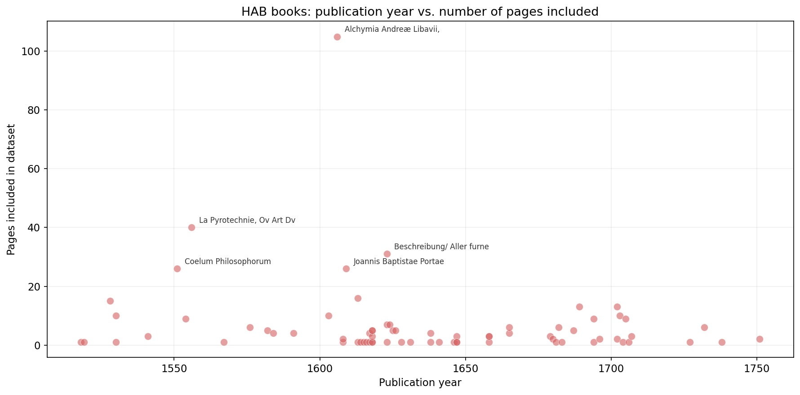

### Technical details

- **Chart type:** Scatter plot.
- **X axis:** `year_normalized` (publication year).
- **Y axis:** `pages_included_count` (number of pages from that book included in the CV dataset).
- **Filtering:** HAB entries only, with both year and page count available.
- **Annotations:** The 5 books with the most pages are labeled with truncated short titles.
- **Assumptions:** Page count reflects curatorial selection, not necessarily the total illustration content of each book.

### What it shows

This plot reveals the relationship between when a HAB book was published and how many of its pages were selected for the CV dataset. The clear outlier is Libavius's *Alchymia* (1606) with 104 pages. Most books contribute fewer than 10 pages regardless of their date. There is no obvious trend suggesting that earlier or later books contribute more pages — the selection appears to be driven by illustration density rather than publication date.

---

## 8. Collection overview

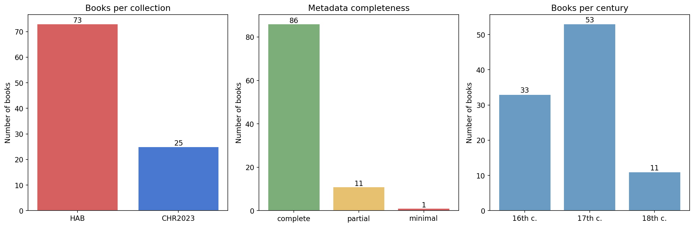

### Technical details

- **Chart type:** Three-panel bar chart.
- **Panel 1 — Books per collection:** Count of entries by `source_collection` (CHR2023 vs HAB).
- **Panel 2 — Metadata completeness:** Count by `metadata_completeness` field, which classifies each entry as "complete" (all 4 key fields: author, year, publisher, place), "partial" (2–3 of 4), or "minimal" (0–1). The value `[S.l.]` (sine loco, "without place") is treated as missing.
- **Panel 3 — Books per century:** Count by `century` field (derived: years 1500–1599 = "16th c.", etc.).
- **Exact counts** are labeled above each bar.

### What it shows

A high-level summary of the dataset composition. The HAB collection (73 books) is roughly three times the size of the CHR2023 corpus (25 books). Metadata quality is high: 86 of 98 entries have complete bibliographic information; the 11 "partial" entries are mostly anonymous works where no author could be identified; 1 entry is "minimal" (an undated anonymous *Probierbüchlein*). The 17th century is the best-represented period (53 books), followed by the 16th century (33) and the 18th century (11 — only its first half, since the dataset ends around 1750).

---

## 9. Place × decade heatmap

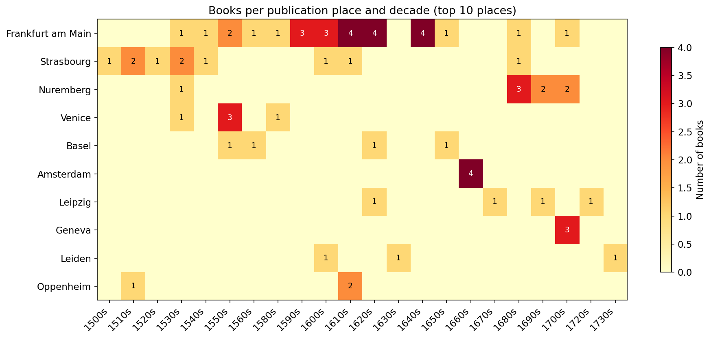

### Technical details

- **Chart type:** Heatmap (imshow).
- **Data fields:** `place_normalized` (rows) × decade (columns, from `year_normalized`).
- **Filtering:** Only the top 10 publication places by total count. Entries missing place or year are excluded.
- **Color scale:** YlOrRd (yellow to red). Cell values annotated where > 0. Text color switches to white for high values (> 60% of maximum) for readability.
- **Row order:** By total book count (most prolific city at top).

### What it shows

This heatmap reveals the temporal profile of each major publishing center. Frankfurt am Main shows sustained activity across the entire period but peaks in the 1600s–1640s. Strasbourg is concentrated in the early 16th century (the era of Brunschwig and Grüninger) with a later resurgence. Venice's activity is limited to the mid-16th century (Biringuccio's editions). Amsterdam appears only in the 1650s–1660s (Kircher's works, Janssonius publishing house). Nuremberg emerges late (1680s–1700s) as a center for German-language practical manuals. This pattern reflects real shifts in the geography of alchemical publishing.

---

## 10. Author × place heatmap

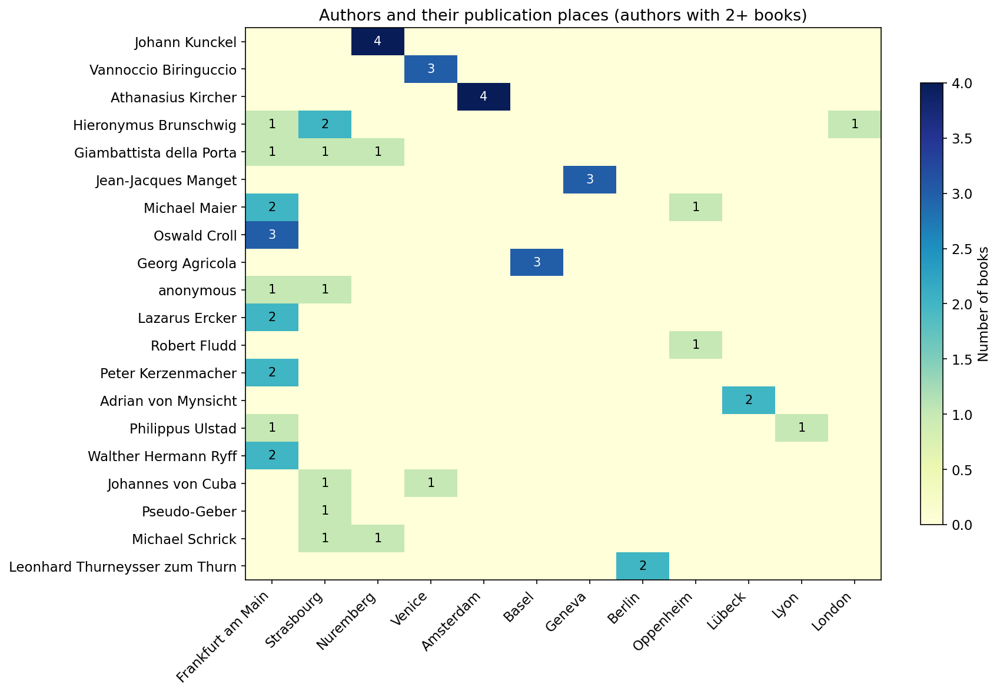

### Technical details

- **Chart type:** Heatmap (imshow).
- **Data fields:** `author_display` (rows) × `place_normalized` (columns).
- **Filtering:** Only authors with 2+ books. Columns limited to the top 12 places used by these authors. All-zero columns are dropped.
- **Color scale:** YlGnBu (yellow-green-blue). Cell values annotated where > 0.
- **Row order:** Authors sorted by total book count (descending).
- **Assumptions:** Same author grouping as Figure 4.

### What it shows

This heatmap shows the geographic footprint of each prolific author. Some authors are strongly associated with a single city: Kunckel with Nuremberg (4 of 5 books), Kircher with Amsterdam (4 of 4), Manget with Geneva (3 of 3). Others published across multiple cities: Biringuccio in Venice, Paris, and Bologna; della Porta in Frankfurt, Nuremberg, Venice, and Strasbourg; Brunschwig in Strasbourg, Frankfurt, and London. The single-city pattern usually reflects a stable author–publisher relationship (see Figure 22), while multi-city patterns indicate translations or posthumous editions by different publishers.

---

## 11. Publisher × decade heatmap

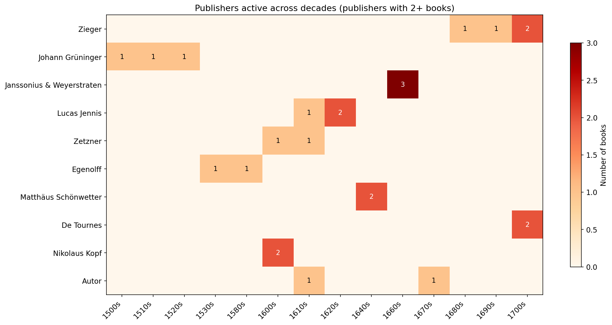

### Technical details

- **Chart type:** Heatmap (imshow).
- **Data fields:** `publisher_normalized_inferred` (rows) × decade (columns).
- **Filtering:** Only publishers with 2+ books in the dataset.
- **Color scale:** OrRd (orange to red).
- **Row order:** By total book count (descending).
- **Assumptions:** Publisher names are from ChatGPT's normalized form, which may group minor spelling variants but does not merge distinct publishers.

### What it shows

This figure reveals the active periods of major publishers. Johann Grüninger spans the longest period (1500s–1520s), reflecting three decades of Strasbourg printing. The Egenolff firm (Christian Egenolff and his heirs) appears in the 1540s–1560s in Frankfurt. Lucas Jennis is concentrated in the 1610s–1620s, a key period for alchemical publishing in Frankfurt. Zieger dominates the late period (1680s–1700s) in Nuremberg. Each publisher's bar shows a relatively compact active window, typically 2–3 decades, consistent with the lifespan of early modern printing firms.

---

## 12. Language by decade

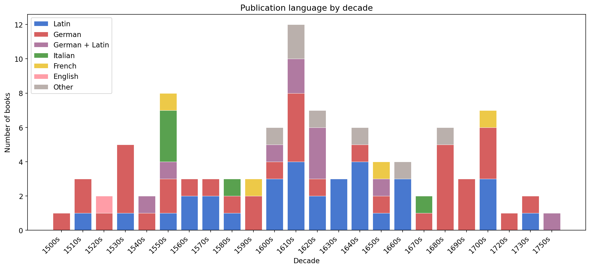

### Technical details

- **Chart type:** Stacked bar chart.
- **Data fields:** `language_normalized` (simplified to 7 categories: Latin, German, German + Latin, Italian, French, English, Other) × decade (from `year_normalized`).
- **Language simplification:** Languages containing both "German" and "Latin" are classified as "German + Latin". The "Other" category captures entries marked "uncertain".
- **Stacking order:** Latin (bottom), German, German + Latin, Italian, French, English, Other (top).
- **Colors:** Consistent language palette used across all figures (Latin = blue, German = red, Italian = green, French = yellow, English = pink).

### What it shows

This is the raw-count companion to Figure 25 (which shows proportions). German-language books appear throughout the period. Italian works are concentrated in the 1550s (Biringuccio's *Pirotechnia*). Latin increases through the 17th century as alchemy became more academic. The "German + Latin" bilingual category peaks in the 1610s–1620s. French appears sporadically. The 1610s is the single busiest decade with 12 books, reflecting the intense publishing activity around alchemy in Frankfurt at that time.

---

## 13. Edition geographic spread

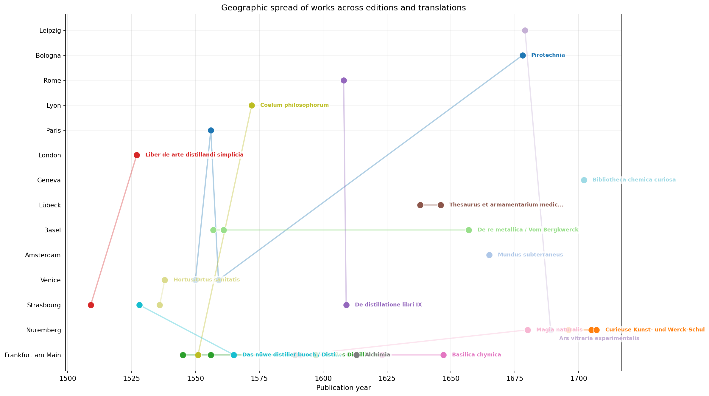

### Technical details

- **Chart type:** Scatter plot with connecting lines and inline labels.
- **X axis:** `year_normalized` (publication year).
- **Y axis:** `place_normalized` (publication city), ordered by frequency.
- **Data:** Only works with 2+ entries in the dataset (`short_title_likely_identical_shared` groupings).
- **Lines:** Connect editions of the same work chronologically, showing geographic migration.
- **Labels:** Each work's title is placed near its latest edition (to avoid crowding in the dense early cluster). A collision-avoidance algorithm tries multiple offset positions.
- **Colors:** Each work has a distinct color (tab20 colormap).

### What it shows

This is one of the most information-rich figures. Each line traces how a single work traveled across cities over time as it was reprinted, re-edited, or translated. Biringuccio's *Pirotechnia* starts in Venice (1550), moves to Paris as a French translation (1556), returns to Venice for Italian reprintings (1559), and finally appears in Bologna (1678) — a journey spanning 128 years and 4 cities. Brunschwig's distillation manual travels from Strasbourg to London (an English translation). Agricola's *De re metallica* stays in Basel but spans a century. Works that don't move geographically (like Kircher's *Mundus subterraneus*, all printed in Amsterdam) appear as horizontal clusters.

---

## 14. Publisher × place heatmap

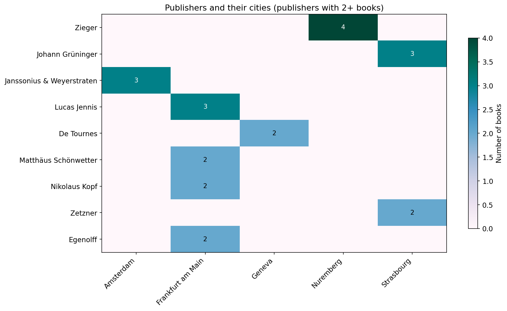

### Technical details

- **Chart type:** Heatmap (imshow).
- **Data fields:** `publisher_normalized_inferred` (rows) × `place_normalized` (columns).
- **Filtering:** Only publishers with 2+ books. All-zero columns dropped.
- **Color scale:** PuBuGn (purple-blue-green).

### What it shows

This confirms what we would expect from early modern book history: publishers were overwhelmingly local. Each publisher operates in exactly one city. Zieger is in Nuremberg, Grüninger in Strasbourg, Janssonius & Weyerstraten in Amsterdam, Lucas Jennis in Frankfurt, and so on. There are no multi-city publishers in this dataset — unlike modern publishing houses, early modern printers were tied to a single workshop and local market. This means that when a work appears in a new city, it almost always involved a new publisher.

---

## 15. Author publication timelines

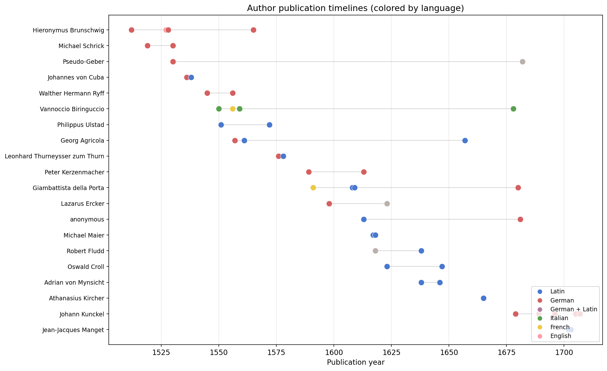

### Technical details

- **Chart type:** Scatter plot (one row per author, dots colored by language).
- **Data fields:** `author_display`, `year_normalized`, `language_normalized`.
- **Filtering:** Only authors with 2+ books.
- **Y axis:** Authors sorted by their earliest publication year.
- **Colors:** Language palette (Latin = blue, German = red, Italian = green, French = yellow, English = pink, German + Latin = purple).
- **Lines:** Gray horizontal lines connect the earliest and latest publication for each author.

### What it shows

This figure shows each author's publishing career as a horizontal span, with individual books as colored dots. The color encoding reveals multilingual publishing patterns. Biringuccio's dots include green (Italian) and yellow (French), showing his work was translated. Brunschwig's span includes red (German) and pink (English). Authors like Kircher and Manget publish exclusively in Latin (blue dots), while Kunckel publishes only in German (red). The gray connecting lines show how long each author's works remained in circulation — some spans represent the author's own active career, while longer spans indicate posthumous reprintings.

---

## 16. Place × language

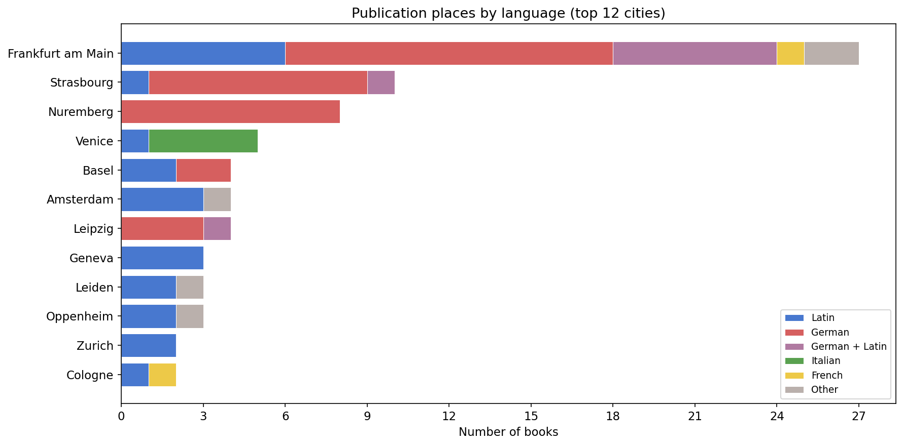

### Technical details

- **Chart type:** Stacked horizontal bar chart.
- **Data fields:** `place_normalized` (y axis) × simplified `language_normalized` (stacked segments).
- **Filtering:** Top 12 places by total book count. Entries missing place or language excluded.
- **Language simplification:** Same as Figure 12 (German + Latin grouped, "uncertain" → Other).
- **Colors:** Standard language palette.

### What it shows

This reveals the linguistic character of each publishing center. Frankfurt am Main is the most multilingual city — it published in Latin, German, German + Latin, French, and more, reflecting its role as an international book fair city. Strasbourg is predominantly German with some Latin. Nuremberg is exclusively German (practical handbooks). Venice is exclusively Italian. Amsterdam and Geneva publish in Latin (scholarly works by Kircher and Manget). Basel mixes German and Latin (Agricola's works in both languages). This pattern maps onto the well-known linguistic geography of early modern European publishing.

---

## 17. Edition language shifts

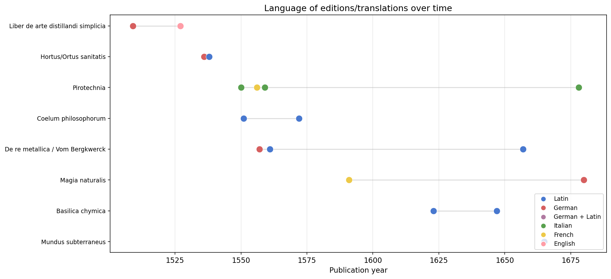

### Technical details

- **Chart type:** Scatter plot with connecting lines, colored by language.
- **Data:** Works from the `short_title_likely_identical_shared` groupings where the language changes between editions. Works where all editions share the same language are excluded.
- **Y axis:** Works sorted by earliest publication year.
- **Colors:** Language palette (same as Figures 12, 15, 16).
- **Gray lines** connect editions chronologically.

### What it shows

This figure isolates the works that crossed language boundaries — i.e., were translated. Nine works in the dataset show language variation across editions. Brunschwig's *Liber de arte distillandi simplicia* goes from German (1509) to English (1527). Biringuccio's *Pirotechnia* starts in Italian (1550) and gains a French edition (1556). Della Porta's *Magia naturalis* appears in French (1591) before a German edition (1680). Agricola's *De re metallica* starts in German (1557) and later appears in Latin (1561, 1657). The *Basilica chymica* moves from German + Latin to pure Latin. These translation paths reveal the circulation of technical knowledge across linguistic communities.

---

## 18. Edition detail: place, publisher, language

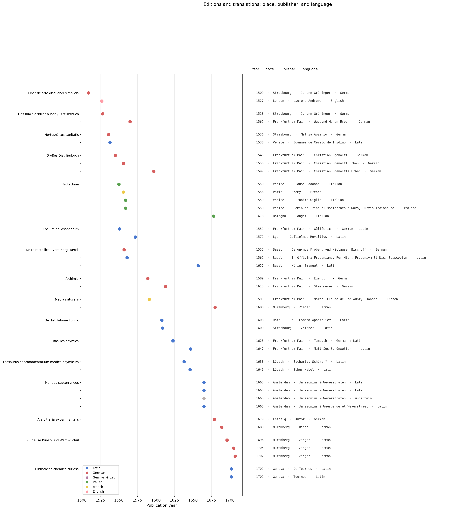

### Technical details

- **Chart type:** Two-panel layout. Left panel: timeline scatter (dots colored by language). Right panel: tabular details (year, place, publisher, language) in monospace text.
- **Data:** All works with 2+ entries in the `short_title_likely_identical_shared` groupings. Within each group, editions are sorted by year.
- **Y axis:** Each edition gets its own row, grouped by work title (shown on the left y-axis labels). A gap separates different works.
- **Publisher field:** Uses `publisher_normalized_inferred` (ChatGPT-improved form) when available, falling back to `publisher_normalized`.
- **Colors:** Standard language palette.

### What it shows

This is the most detailed edition-level visualization. For each work that appears multiple times in the dataset, it shows every edition's year, city, publisher, and language on a single chart. You can trace the full publication history: for example, Brunschwig's distillation manual starts with Grüninger in Strasbourg (1509, German), gets an English translation by Laurens Andrewe in London (1527), then continues with Grüninger in Strasbourg (1528) and Weygand Dillen/Egenolff heirs in Frankfurt (1565, 1597). The right-hand table makes it possible to read exact details that would be illegible as scatter plot labels.

---

## 19. Translation flows

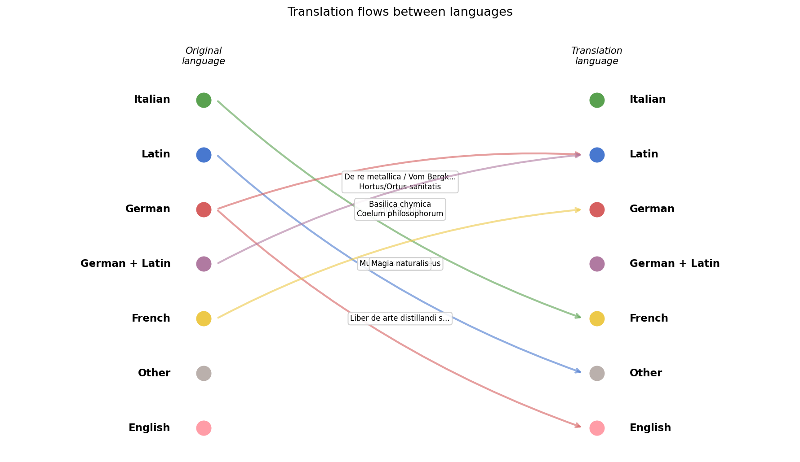

### Technical details

- **Chart type:** Network/flow diagram with arrows.
- **Data:** For each multi-edition work group, the language of the earliest edition is treated as the "original language" and any subsequent editions in a different language as "translations."
- **Nodes:** Languages appear on both left ("Original language") and right ("Translation language") sides.
- **Arrows:** Connect original → translation language. Arrow color matches the original language.
- **Labels:** Work titles appear in white boxes along each arrow path.
- **Assumptions:** The earliest edition in the dataset is assumed to represent the original language. This is generally correct but could be misleading if the dataset happens to include a translation but not the original (unlikely but not verified).

### What it shows

This diagram summarizes the directionality of translations in the corpus. German works were translated into Latin (De re metallica, Hortus sanitatis), into English (Liber de arte distillandi), and from German + Latin into pure Latin or German. Italian works moved to French (Pirotechnia). French works were translated into German (Magia naturalis). Latin works were also translated into other languages. The arrow pattern shows that German ↔ Latin was the most common translation axis, consistent with the bilingual scholarly culture of the Holy Roman Empire. Italian → French reflects Mediterranean knowledge exchange, while German → English shows the early transmission of practical knowledge to England.

---

## 20. Prolific author works detail

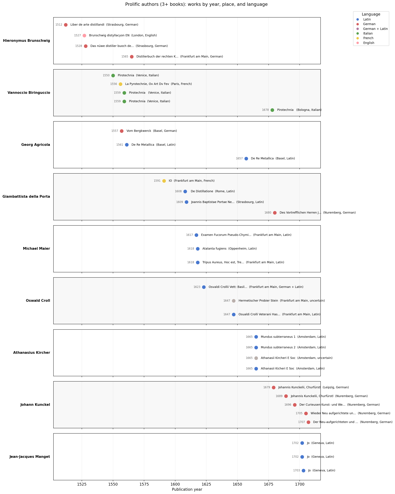

### Technical details

- **Chart type:** Multi-panel figure with one subplot per author.
- **Data fields:** `author_display`, `year_normalized`, `short_title`, `place_normalized`, `language_normalized`.
- **Filtering:** Authors with 3+ books in the dataset (10 authors).
- **Layout:** Each author gets a horizontal strip. Within each strip, books are arranged vertically (one per row), sorted by publication year.
- **Labels:** Year shown to the left of each dot; title, place, and language shown to the right.
- **Colors:** Language palette (dots colored by language).
- **Alternating background:** Every other author strip has a light gray background for visual separation.

### What it shows

This figure provides a complete publication profile for each of the dataset's most prolific authors. For Biringuccio, you can see all 5 editions of the *Pirotechnia* spread across Venice, Paris, and Bologna in Italian, French, and Italian again. For Brunschwig, 4 works span from 1512 to 1565, moving between Strasbourg, London, and Frankfurt in German and English. For Kircher, all 4 entries are from Amsterdam in Latin — a single publisher (Janssonius) producing his multi-volume *Mundus subterraneus*. Kunckel's 5 books are all German, concentrated in Nuremberg in the 1680s–1700s.

---

## 21. Edition longevity

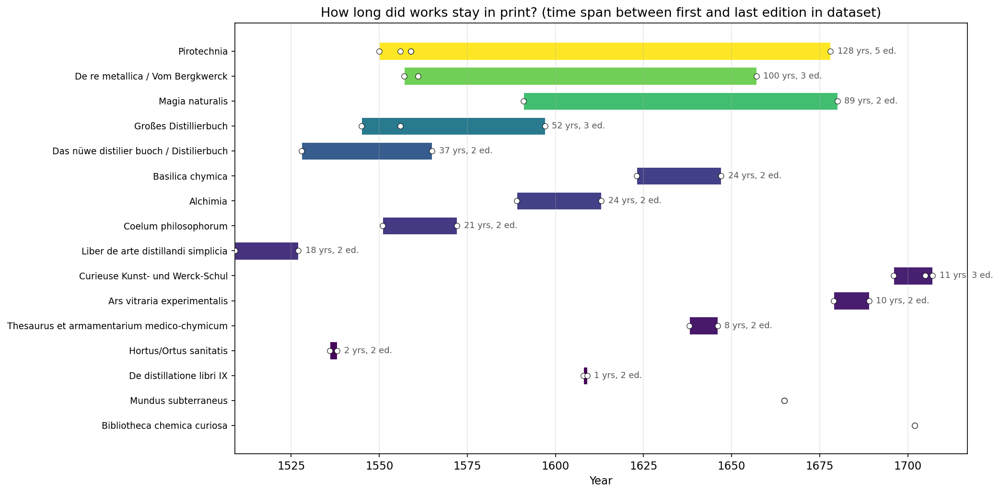

### Technical details

- **Chart type:** Horizontal bar chart (Gantt-style).
- **Data:** For each work with 2+ editions, the bar spans from the first to the last publication year in the dataset.
- **Metric:** Time span in years (last edition year − first edition year). Number of editions also shown.
- **White dots:** Mark the year of each individual edition within the span.
- **Color scale:** Viridis, mapped to span length (longer = brighter/yellow).
- **Sorting:** By span length, descending.
- **Caveat:** This shows the span covered *within this dataset*, not the full publication history of each work. A work may have had editions before or after the ones included here.

### What it shows

Biringuccio's *Pirotechnia* has the longest documented span at 128 years (1550–1678, 5 editions), followed by Agricola's *De re metallica* at 100 years (3 editions) and della Porta's *Magia naturalis* at 89 years (2 editions). These were foundational technical works that remained relevant across generations. At the other end, *Mundus subterraneus* and *Bibliotheca chemica curiosa* show 0-year spans — multiple entries from the same year, representing different volumes or simultaneous printings rather than true re-editions. The white dots within each bar reveal whether editions were evenly spaced or clustered.

---

## 22. Author–publisher relationships

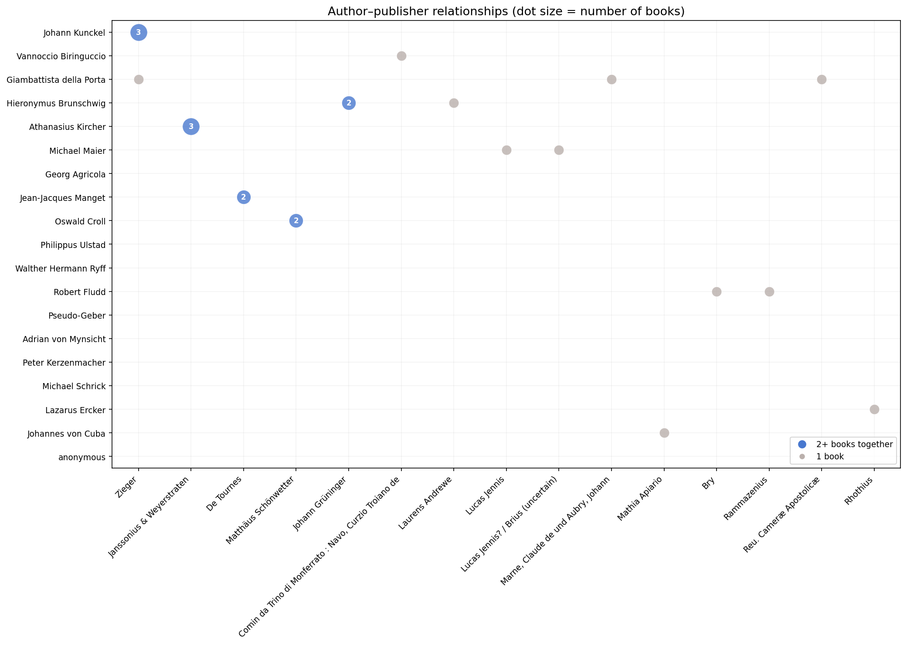

### Technical details

- **Chart type:** Bubble/dot matrix.
- **Data fields:** `author_display` (rows) × `publisher_normalized_inferred` (columns).
- **Filtering:** Authors with 2+ books. Top 15 publishers by count.
- **Dot size:** Proportional to the number of books for each author–publisher pair.
- **Colors:** Blue for repeat collaborations (2+ books), gray for single books.
- **Numbers:** Shown inside blue dots for 2+ collaborations.

### What it shows

Most author–publisher relationships in early modern printing were one-off arrangements. However, five repeat collaborations stand out: Kunckel × Zieger (3 books in Nuremberg), Kircher × Janssonius & Weyerstraten (3 books in Amsterdam), Brunschwig × Grüninger (2 books in Strasbourg), Croll × Schönwetter (2 books in Frankfurt), and Manget × De Tournes (2 books in Geneva). These repeat pairings reflect stable professional relationships between authors (or their estates) and trusted publishers — a pattern well documented in book history but visible here at a glance.

---

## 23. Author geographic reach

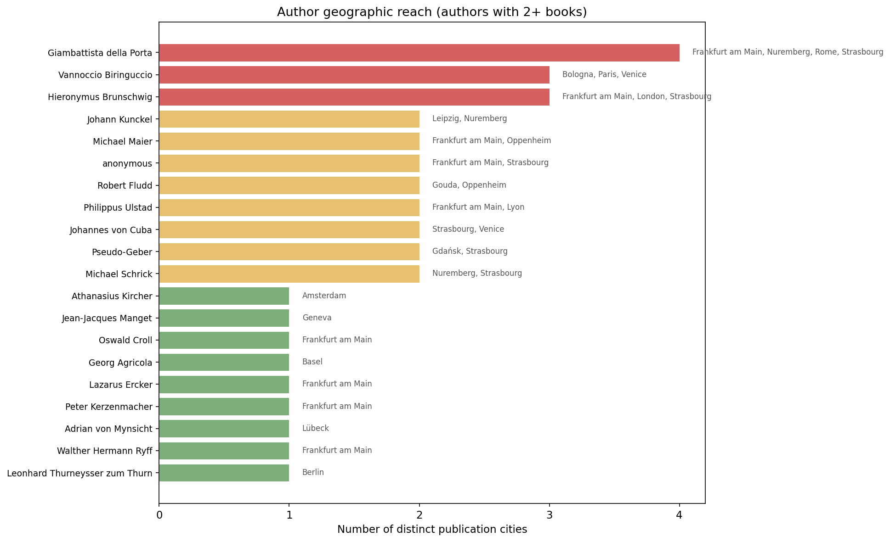

### Technical details

- **Chart type:** Horizontal bar chart.
- **Metric:** Number of distinct publication cities per author (from `place_normalized`).
- **Filtering:** Authors with 2+ books.
- **Sorting:** By number of cities (descending), then by number of books.
- **Labels:** City names listed to the right of each bar.
- **Colors:** Red (3+ cities), yellow (2 cities), green (1 city).
- **Caveat:** Multi-city reach often reflects translations or posthumous editions rather than the author personally arranging publication in multiple cities.

### What it shows

Giambattista della Porta has the widest geographic reach (4 cities), followed by Biringuccio and Brunschwig (3 cities each). These are authors whose works were translated and reprinted far beyond their original place of publication. By contrast, authors like Kircher (only Amsterdam), Manget (only Geneva), and Agricola (only Basel) had their works published in a single city — either because they worked closely with one publisher or because their works were not translated in the period covered. The distinction between "single-city" and "multi-city" authors roughly maps onto the distinction between regional and international circulation.

---

## 24. City activity timelines

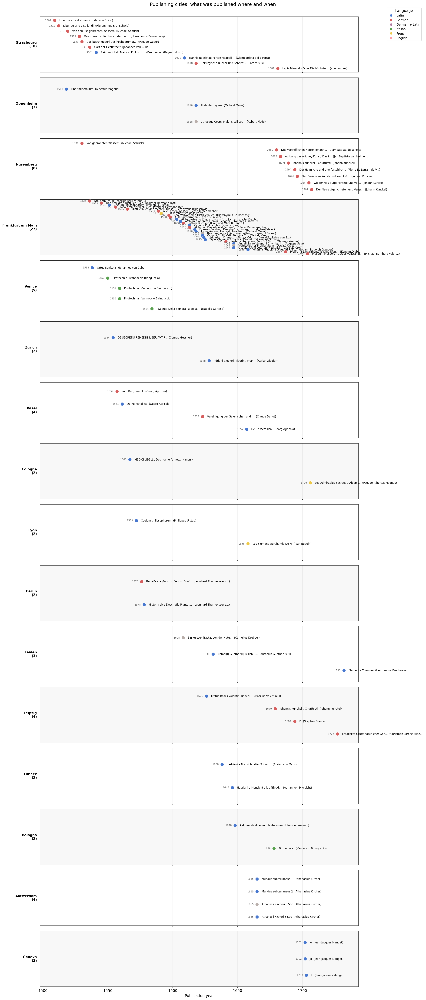

### Technical details

- **Chart type:** Multi-panel figure with one subplot per city (similar layout to Figure 20).
- **Data fields:** `place_normalized`, `year_normalized`, `short_title`, `author_display`, `language_normalized`.
- **Filtering:** Cities with 2+ books. Cities sorted by their earliest publication year.
- **Layout:** Each city gets a horizontal strip labeled with the city name and book count. Within each strip, books are arranged one per row, sorted by publication year.
- **Labels:** Year shown to the left of each dot; short title and author shown to the right.
- **Colors:** Dots colored by language (standard language palette).
- **Alternating backgrounds:** Every other city strip has a light gray background for visual separation.

### What it shows

This figure shows exactly which books were published in each city and when. Strasbourg's early dominance is driven by Brunschwig's distillation manuals and Grüninger's press. Frankfurt am Main — the largest section with 27 books — reveals a diverse mix: Egenolff's practical handbooks in the 1540s–60s, alchemical compendia by Jennis and Schönwetter in the 1610s–20s, and Croll's and Maier's Latin works. Venice is exclusively Italian (Biringuccio's *Pirotechnia*). Amsterdam's cluster is all Kircher — four entries of *Mundus subterraneus* from Janssonius. Nuremberg's late-period activity is dominated by Kunckel's German-language practical manuals from Zieger's press. The color coding reveals that cities have linguistic profiles: Venice is green (Italian), Amsterdam is blue (Latin), Nuremberg is red (German), while Frankfurt shows the full spectrum.

---

## 25. Language proportions over time

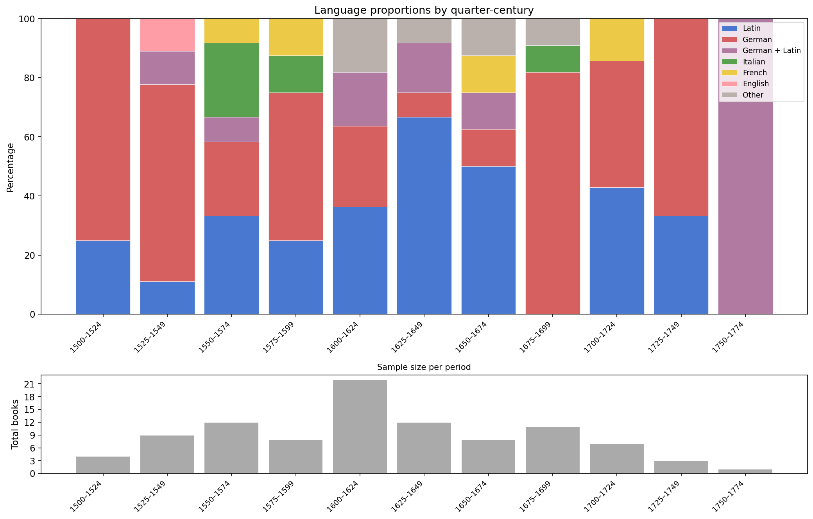

### Technical details

- **Chart type:** Two-panel figure. Top: normalized (100%) stacked bar chart. Bottom: total book count per period.
- **Time binning:** 25-year periods (quarter-centuries: 1500–1524, 1525–1549, etc.), chosen to provide smoother proportions than decades while maintaining temporal resolution.
- **Language simplification:** Same categories as Figure 12.
- **Top panel:** Each bar sums to 100%, showing the proportion of each language within that period.
- **Bottom panel:** Shows the absolute number of books per period — essential context for interpreting the proportions. A period with 3 books can produce a misleading 100% bar.
- **Colors:** Standard language palette.

### What it shows

This is the proportional companion to Figure 12. The top panel reveals the shifting linguistic landscape of alchemical publishing. In the earliest period (1500–1524), German and Latin share the field equally. In 1525–1549, German dominates (practical handbooks by Brunschwig, Ryff). Italian appears in 1550–1574 (Biringuccio) and then disappears. Latin's share grows steadily through the 17th century, peaking around 1625–1649 — the era of Croll, Maier, and the rise of academic chymistry. German makes a strong comeback in 1675–1699 (Kunckel's practical manuals). The bottom panel is crucial: the 1750–1774 bar shows 100% German + Latin, but this represents only 1 book — a reminder that proportions from small samples can be misleading.

---

## How to regenerate

```bash
# Requires: Python 3.8+, pandas, matplotlib, numpy
pip3 install pandas matplotlib numpy

# Generate all 25 figures
python3 visualize_corpus.py
```

Figures are saved to the `figures/` directory. The script reads `master_metadata.csv` from the same directory. All paths are hardcoded at the top of the script.

## Color conventions

The following color assignments are used consistently across all figures:

| Element | Color | Hex |
|---------|-------|-----|
| Latin | Blue | `#4878CF` |
| German | Red | `#D65F5F` |
| German + Latin | Purple | `#B07AA1` |
| Italian | Green | `#59A14F` |
| French | Yellow | `#EDC948` |
| English | Pink | `#FF9DA7` |
| Other/uncertain | Gray | `#BAB0AC` |
| CHR2023 collection | Blue | `#4878CF` |
| HAB collection | Red | `#D65F5F` |
